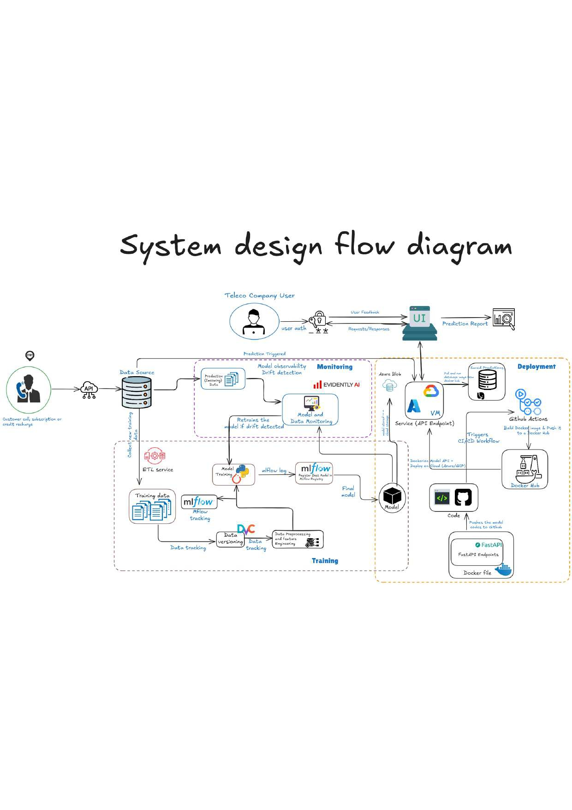

# Customer Churn Prediction – ML Backend

This repository contains the **machine learning backend service for Customer Churn Prediction**, implemented using **FastAPI** and deployed on an **Azure Virtual Machine** using **Docker and Docker Compose**.

The service exposes a REST API that accepts customer data and returns churn predictions, making it suitable for integration with web or mobile

---

## 📌 Project Overview

Customer churn prediction helps businesses identify customers who are likely to stop using their services.  
This backend application provides a **scalable, containerized inference service** for serving a trained machine learning model via HTTP endpoints.

---

## Features

- FastAPI-based RESTful API
- Machine learning model inference
- Input data validation using Pydantic
- Dockerized application
- Multi-service orchestration with Docker Compose
- Deployed on Azure Virtual Machine
- Ready for production integration

---

## 🛠️ Tech Stack

- **Backend Framework:** FastAPI
- **Machine Learning:** Scikit-learn / XGBoost
- **Language:** Python
- **Containerization:** Docker
- **Orchestration:** Docker Compose
- **Deployment:** Azure Virtual Machine (Linux)
- **Web Server:** Uvicorn

---

## 📂 Repository Structure

# Backend for serving churn prediction

This is a backend service for serving Customer Churn Machine Learning model.

## API 
(`/register`)
(`/login`)

